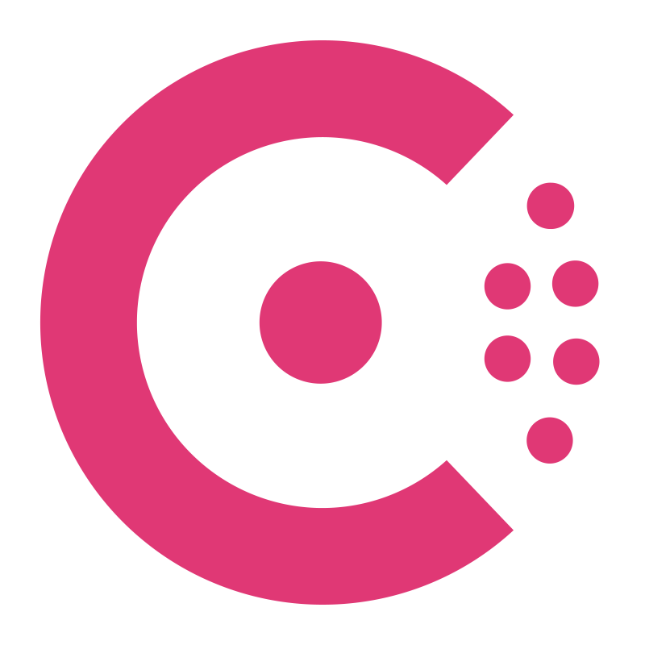

# Olá sou Clayton

Recentemente com sobrenome "Cavaleiro", meu nome é `Clayton Cavaleiro` (Pendente de terminar formalização dos documentos de identidade :P), sou um desenvolvedor com paixão por codificação, videogames antigos e hands-on com automação.

Para quem curte uma formalidade, segue meus currículos em [português](https://github.com/claytonsilva/claytonsilva/blob/main/RESUME_PT-BR.md) e em [inglês](https://github.com/claytonsilva/claytonsilva/blob/main/RESUME_EN-US.md).

Para quem curte uma rede social, segue meu perfil em [português](https://www.linkedin.com/in/claytonssilva/) e em [inglês](https://www.linkedin.com/in/claytonssilva/?locale=en_US).

## <b> Github Stats </b>

 

## Empresas que orgulhosamente contribuí

  
  
  
  
  
  
  
  
  

## Tecnologias que já futuquei

                     
  

## Projetos

  

## Certificações

 

<!-- Redes Sociais -->
<!--h2 without bottom border-->

  <ul align="center">
    
<h2 style="display: inline-block">Meus Contatos</h2>

  <!--icons and links-->
  

  
  
  
  

  </ul>

